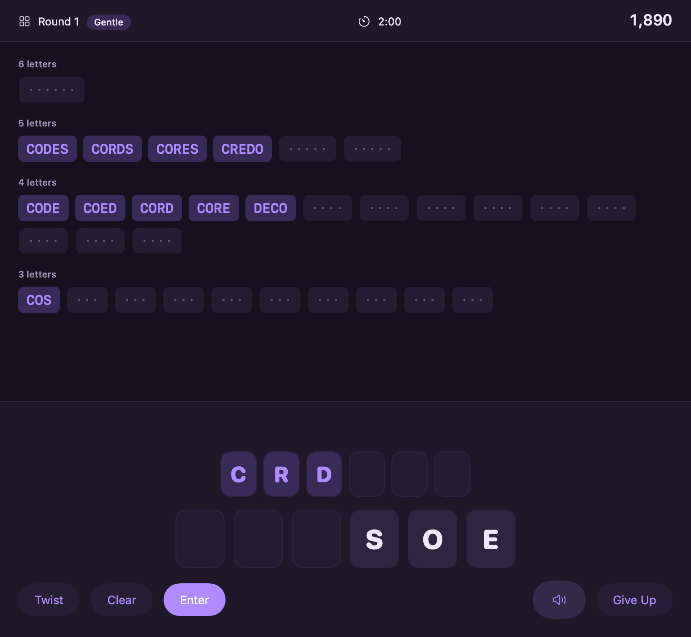
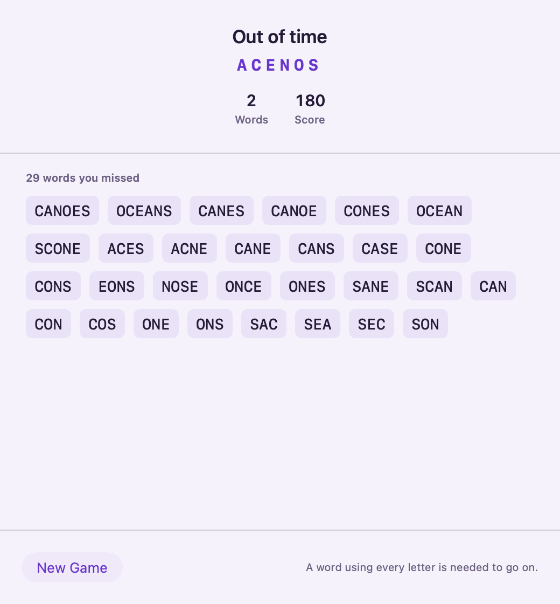
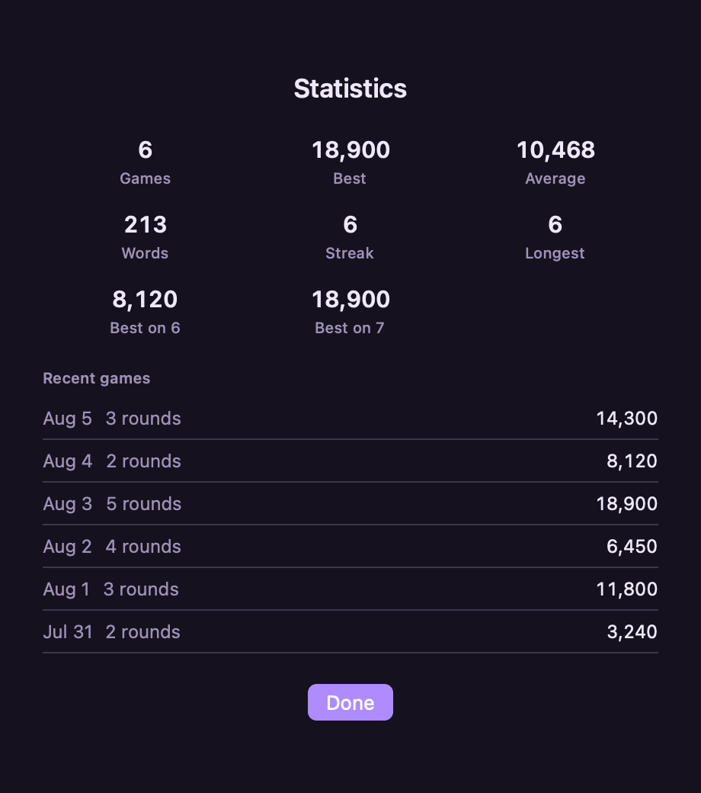
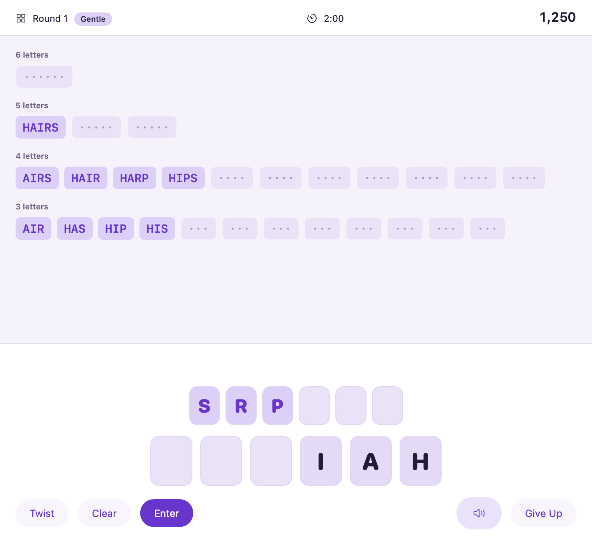

# Twist

A word game for macOS in the shape of the old Text Twist: six or seven scrambled letters, two
minutes, and every word you can find in them. Find one that uses every letter and you move on.

It keeps score across sittings, shows you the words you missed, and — unlike the 2001 original —
tells you nothing you can't act on.

<p align="center">
  
</p>

---

## Install

**macOS 15 (Sequoia) or later. Apple Silicon.**

### Build it yourself — the easy path

This is genuinely the least friction, because an app you build locally isn't quarantined and
macOS opens it without complaint.

You need Apple's Command Line Tools, which most Macs already have. If not, `xcode-select
--install` fetches them (~1 GB, a few minutes). **Full Xcode is not required.**

```bash
git clone https://github.com/DannyCrews/twist.git
cd twist
make app
open build/Twist.app
```

That's it. Drag `build/Twist.app` to your Applications folder if you want to keep it.

### If someone sent you the app

macOS will refuse to open it, and the message it shows ("damaged", or "cannot be opened") is
misleading — it means *unsigned*, not broken. Signing an app so it opens cleanly on someone
else's Mac requires a paid Apple Developer account, which this project doesn't have.

To open it anyway:

1. Move `Twist.app` to your Applications folder.
2. Double-click it. macOS blocks it. Dismiss the dialog.
3. Open **System Settings → Privacy & Security**.
4. Scroll to the bottom. There's a line about Twist being blocked, and an **Open Anyway** button.
5. Click it, enter your password, then open Twist again.

You only do this once.

> On macOS 14 (Sonoma) and earlier this was a Control-click → Open on the app itself. Apple
> removed that shortcut in Sequoia, which is why it's now a trip through Settings.

---

## Playing

Type. Letters lift out of the rack as you use them.

| Key | Does |
|---|---|
| **A–Z** | Take that letter from the rack |
| **Return** | Submit the word |
| **Delete** | Take the last letter back |
| **Escape** | Clear the line |
| **Space** | Twist — shuffle the rack |
| **⌘N** | New game |
| **⇧⌘T** | Statistics |

You can click the tiles instead of typing, if you'd rather.

The board shows a slot for every word in the rack, grouped by length, so you always know what's
left to find. Words score ten points per letter squared — 90 for a three, 490 for a seven — and
clearing the whole board doubles the round.

<p align="center">
  
  
</p>

---

## What's different from the original

**It tells you what you missed.** The original told you only that you'd failed. Every round ends
with the words that were on the board, longest first. That's what turns it from a test into
something you get better at.

**The word list won't taunt you.** Word games built on a Scrabble dictionary expect you to find
words nobody knows. Here, everything in the dictionary *scores* — if you know `aalii`, take the
points — but only reasonably common words count toward the round's target, so "find them all"
stays winnable.

**It remembers.** Scores, streaks, best-per-rack-size, and the last few games.

**It sounds calm.** Every tone is synthesized from a single pentatonic scale, so nothing ever
clashes. A word you got wrong is a soft low note, not a buzzer. The ten-second warning is one
tone, not a ticking clock.

**It looks calm too.** Deep plum rather than black, soft lavender rather than white — a flat
white field behind a running clock is tiring. It opens dark; **View → Appearance** switches to
light or follows the system. Both schemes are checked against WCAG contrast ratios: body text
clears 12:1, and the tightest pair measures 4.8:1 against a 4.5 floor.

<p align="center">
  
</p>

---

## Building and hacking

```bash
make dict        # rebuild the word list from source data
make app         # assemble build/Twist.app
make run         # run without bundling
make test        # unit tests
make snapshots   # render every screen to PNG, light and dark
make sounds      # export every audio cue to WAV
```

**Use `make test`, not `swift test`.** The Command Line Tools ship swift-testing outside the
toolchain, and without the search paths the Makefile adds, SwiftPM's generated test runner
compiles its own body away and exits 0 having run nothing at all. `swift test` now fails loudly
instead of passing silently; the Makefile explains the mechanism at the top.

| Path | What it is |
|---|---|
| `Sources/TwistKit/` | Every rule, with no UI imports — signatures, lexicon, round state machine, scoring, statistics |
| `Sources/Twist/` | The SwiftUI app |
| `Sources/dicttool/` | Offline pipeline that builds and verifies the shipped word list |
| `Tests/TwistKitTests/` | 49 tests over the rules |

There is no Xcode project, and no dependency on Xcode. Everything builds with SwiftPM against
the Command Line Tools SDK.

### The word list

`dicttool` merges two public datasets into one 546 kB file that loads in about 44 ms:

- **[ENABLE](https://github.com/dolph/dictionary)** — Alan Beale's Enhanced North American
  Benchmark Lexicon, public domain, 172,823 words. This is the accept list.
- **[SUBTLEX-US](https://github.com/words/subtlex-word-frequencies)** — word counts from a
  corpus of film subtitles. These decide which words are common enough to be part of a round's
  target.

Capitalized SUBTLEX entries are dropped rather than folded in. SUBTLEX capitalizes a word when
it usually appears capitalized, which is how it marks proper nouns; lowercasing them made `mae`,
`mel` and `nam` count as ordinary English words.

The result is 51,852 playable words, 12,269 of them common, and 6,094 racks sorted into four
difficulty tiers.

```bash
swift run dicttool sample    # print racks with their solutions, to judge how they play
swift run dicttool verify    # assert the invariants the game depends on
swift run dicttool stats     # the distributions behind the tuning constants
```

Every tuning constant lives in one place: `Sources/dicttool/Build.swift`.

### Verifying the interface

`make snapshots` renders every screen to PNG in light and dark **without a display**, and
`make sounds` writes every cue to WAV with its peak level and duration. Both run headless, which
means the look and the sound design can be checked in a build rather than by eye and ear.

One gotcha worth knowing if you extend the UI: `ImageRenderer` produces nothing at all for a
`ScrollView`. That's why the board doesn't scroll and why `ScrollIfNeeded` exists — without it,
snapshots come back showing empty screens that look fine.

---

## Credits and licensing

Text Twist was made by GameHouse, a RealNetworks studio, and released in 2001. This is not their
code — none of it was ever published, and nothing here derives from it. **"TextTwist" is a
RealNetworks trademark**, which is why this is called something else.

The bundled word list is built from ENABLE (public domain) and SUBTLEX-US (an academic corpus,
free for research use). If you plan to distribute this commercially, check the SUBTLEX terms
first — the frequency data is the part with strings attached, not the words themselves.

No licence file yet. Ask before reusing.
