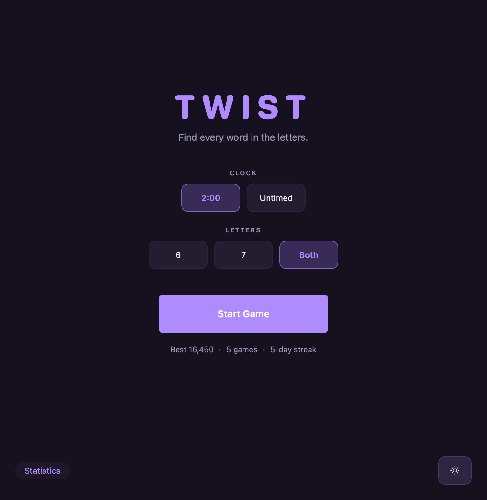
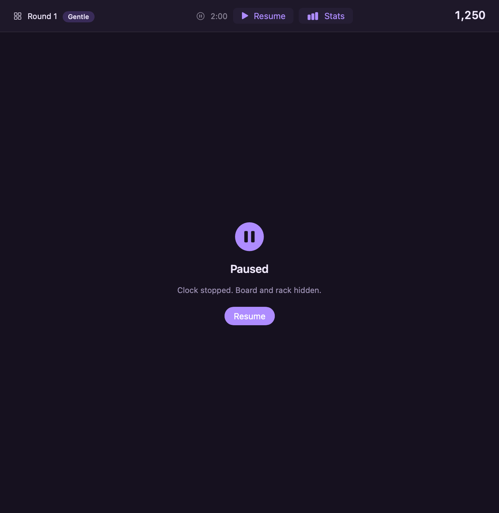
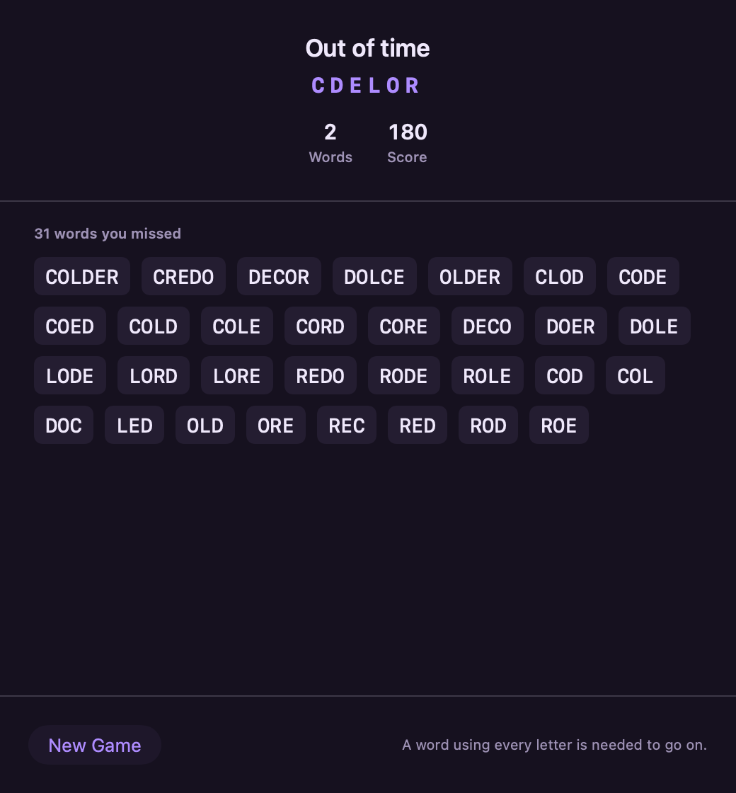
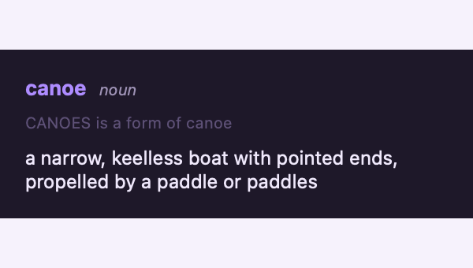

# Twist

**A word game for macOS.** Six or seven scrambled letters, two minutes, and every word you can
find in them. Find one that uses all the letters and you move on to the next rack.

It keeps score across sittings, shows you the words you missed, and tells you what each of them
means.

<p align="center">
  
</p>

---

## Contents

1. [Installing](#installing)
2. [Starting a game](#starting-a-game)
3. [Playing a round](#playing-a-round)
4. [Keyboard reference](#keyboard-reference)
5. [Pausing](#pausing)
6. [When the round ends](#when-the-round-ends)
7. [Looking up a word](#looking-up-a-word)
8. [Statistics](#statistics)
9. [Sound and appearance](#sound-and-appearance)
10. [Troubleshooting](#troubleshooting)
11. [About the words](#about-the-words)

---

## Installing

**Requires macOS 15 (Sequoia) or later, on Apple Silicon.**

Open **Terminal** (press ⌘-Space, type `Terminal`, press Return) and paste this:

```bash
git clone https://github.com/DannyCrews/twist.git && cd twist && make play
```

That's it. It builds the game — about a minute the first time — and opens it.

To keep it in your Applications folder, use `make install` instead of `make play`.

### If it asks to install developer tools

The first time, macOS may show a dialog saying the `git` command requires the **command line
developer tools**. Click **Install**, let it finish — about 1 GB and a few minutes — then paste
the same line again.

That is Apple's own installer, and it is the only prerequisite. `git`, `make` and the Swift
compiler all come from that one package, so installing it once covers everything. **Full Xcode
is not required.**

### Without git

If you would rather not clone, GitHub can hand you a zip instead:

1. Go to **[the repository](https://github.com/DannyCrews/twist)**.
2. Click the green **Code** button, then **Download ZIP**.
3. Double-click the zip to unpack it.
4. Open Terminal, type `cd ` (with the space), drag the unpacked folder onto the Terminal
   window, and press Return.
5. Type `make play` and press Return.

macOS marks downloaded files as quarantined, but that flag does not carry into the app you
build — the compiler writes a new file — so the result opens with no warning either way.

### Why not just send the finished app?

Because macOS would block it. An app arriving by AirDrop, email or download is flagged as
quarantined, and Gatekeeper refuses to open anything unsigned carrying that flag. Getting past
it means a trip through **System Settings → Privacy & Security → Open Anyway**, or a paid Apple
Developer account to sign the app properly.

An app you build on your own Mac was never downloaded, so it is never flagged, and it simply
opens. Same app, same code — the only difference is how it arrived.

---

## Starting a game

Twist opens on a menu rather than dropping you straight into a running clock.

<p align="center">
  
</p>

Two choices, both remembered between launches:

| Setting | Option | |
|---|---|---|
| **Clock** | **2:00** | The original's two minutes per rack. |
| | **Untimed** | No clock at all. Rounds end when you press **End Round**. |
| **Letters** | **6** | Six-letter racks only. |
| | **7** | Seven-letter racks only — more words, more room to work. |
| | **Both** | Mixed at random. |

Press **Start Game**, or just hit **Return**.

Once you've finished a game, your best score, games played, and daily streak appear under the
button.

---

## Playing a round

### The clock

Large, centred, above the board — with a bar beneath it that empties as the time goes. The bar
is the point: you can feel time running down without reading the numbers. At fifteen seconds it
turns a warm colour. There is no ticking.

Untimed games show **∞ Untimed** here instead.

### The board

Everything above the divider is the board: **one slot for every word your rack spells**, grouped
by length, longest group first.

- A slot you haven't found shows **dots** — one per letter — so you always know how many words
  remain and how long they are.
- A slot you *have* found shows the word in purple.
- Found words move to the **front of their group**, so your progress in each length reads at a
  glance.
- A word with a **purple outline** is a **bonus word**: one that was never on the board. Play a
  word the game accepts but didn't list, and it appears, outlined, and scores.

### The rack and the input line

Below the divider are two rows. The upper row is the **word you're building**; the lower row is
your **rack**.

- **Type** a letter and it lifts out of the rack into your word.
- **Click** a rack tile to do the same thing.
- **Click a letter in the word you're building** to send it back — including one in the middle.
- **Delete** takes back the last letter; **Escape** clears the line.

### Twist and Enter

**Twist** shuffles the letters still in your rack. It's the one hint the game offers, and seeing
the same letters in a new order is often all it takes.

**Twist keeps the word you're building.** Letters you've already used stay put; only the ones
left in the rack move, and they pack to the left so the gaps sit at the end.

**Enter** submits the word. So does the **Return** key.

### Scoring

Words score **ten points per letter squared**:

| Letters | 3 | 4 | 5 | 6 | 7 |
|---|---|---|---|---|---|
| **Points** | 90 | 160 | 250 | 360 | 490 |

**Clearing the whole board doubles the round**, so finding every word is worth chasing.

To advance to the next rack you must find the word that uses **every letter**. Without it, the
game ends when the clock does.

### Sounds

| | |
|---|---|
| **A chime** | The word was accepted. |
| **A soft gong** | It wasn't. Deliberately gentle — a word game refuses you often enough. |
| **Three rising bells** | You found the word using every letter. |
| **A warm chord** | You cleared the whole board. |
| **One soft note** | Ten seconds left. Never a ticking clock. |

You never have to look at the screen to know whether a word was accepted.

---

## Keyboard reference

| Key | Does |
|---|---|
| **A–Z** | Take that letter from the rack |
| **Return** | Submit the word |
| **Delete** | Take the last letter back |
| **Escape** | Clear the line |
| **Space** | Twist — shuffle the rack |
| **⌘P** | Pause / resume |
| **⌘N** | New game — back to the menu |
| **⇧⌘T** | Statistics |

---

## Pausing

Press **⌘P**, or the **Pause** button in the top bar.

<p align="center">
  
</p>

The clock stops, and **both the board and the rack are hidden**. That's deliberate — otherwise
pausing would just be unlimited time to work out the anagram.

Opening the statistics screen pauses too, so checking your streak never costs you the round.

---

## When the round ends

A round ends when the clock runs out, when you press **Give Up**, or — in untimed games — when
you press **End Round**.

<p align="center">
  
</p>

You then see **every word that was on the board and you didn't find**, longest first. This is
the part the 2001 original never did: it told you only that you'd failed.

- **Next Round** continues the game — offered only if you found the word using every letter.
- **New Game** returns to the menu.

---

## Looking up a word

**Click any word on the review screen** to see what it means.

<p align="center">
  
</p>

The bubble gives the headword, its part of speech, and the first sense. Click elsewhere to
dismiss it.

When the entry found isn't quite the word you played — looking up `CANOES` finds `canoe` — the
bubble says so, rather than looking like it fetched the wrong thing.

Definitions come from **the dictionary already on your Mac** (New Oxford American, on a US
English system). Nothing is downloaded and nothing is sent anywhere. A word with no entry simply
isn't clickable.

---

## Statistics

Press **⇧⌘T**, or the **Stats** button in the top bar. It's on the start menu too.

<p align="center">
  
</p>

| | |
|---|---|
| **Games** | Games finished. |
| **Best** / **Average** | Highest and mean score. |
| **Words** | Total words found, across every game. |
| **Streak** / **Longest** | Consecutive days played. Several games in one day count as one day. |
| **Best on 6** / **Best on 7** | Your best at each rack size, tracked separately. |

**Recent games** lists the last several sittings with their date, rounds cleared, and score.

### Resetting

**Reset…** clears everything. It asks first, naming how many games it is about to delete,
because the history is the one thing in Twist you can't recreate by playing again.

---

## Sound and appearance

Two buttons sit at the bottom right of the play screen.

| | |
|---|---|
| **Speaker** | Sound on or off. Remembered between launches. |
| **Sun / moon** | Light or dark. Twist opens dark — a flat white field behind a running clock is tiring. |

For a three-way choice including *follow the system*, use **View → Appearance** in the menu bar.

Both appearances are checked against WCAG contrast ratios: body text clears 12:1, and the
tightest pairing measures 4.8:1 against a 4.5 floor.

---

## Troubleshooting

**"Twist.app is damaged and can't be opened."**
It isn't damaged, it's unsigned. You were sent the built app rather than building it
yourself — see [Why not just send the finished app?](#why-not-just-send-the-finished-app).

**Nothing happens when I click a word on the review screen.**
That word has no entry in your Mac's dictionary, so there's nothing to show. Words that do have
one respond to a click and show a pointing-hand cursor.

**No definitions appear at all.**
Open **Dictionary.app** and check a dictionary is enabled under **Dictionary → Settings**. Twist
reads whatever you have installed; it doesn't ship its own.

**A word I know was refused.**
Twist accepts about 34,000 words, and everything it accepts can be found in a dictionary — that
is the rule the word list is built on. Scrabble-only curiosities like `abfarad` and `abvolt`
aren't included.

**The board scrolls during a round.**
Seven-letter racks can spell more words than fit on screen. Making the window taller stops it.

**Where is my data?**
Scores live in `~/Library/Application Support/Twist/history.json`. Preferences are ordinary
macOS defaults. Nothing leaves your Mac.

---

## About the words

Twist accepts **34,161 words**, of which **13,735** are common enough to appear on the board as
targets. The rest still score when you find them — they show up as outlined bonus words.

The list is built from [ENABLE](https://github.com/dolph/dictionary) (a public-domain word
list), [SUBTLEX-US](https://github.com/words/subtlex-word-frequencies) (word frequencies from
film subtitles), and [WordNet](https://wordnet.princeton.edu/license-and-commercial-use)
(Princeton's lexical database).

Two rules shape it:

**Everything it accepts can be looked up.** A word no established dictionary defines is one
nobody will miss — and one the definition bubble could never explain.

**Slurs are removed outright.** ENABLE contains ethnic slurs, and an unfiltered word game will
put them on the board as words to go and find. They're excluded from the list entirely, so they
never appear and never score.

---

Text Twist was made by GameHouse, a RealNetworks studio, in 2001. This is not their code — none
of it was ever published, and nothing here derives from it. **"TextTwist" is a RealNetworks
trademark**, which is why this is called something else.

Building, testing, and how the word list is made: **[DEVELOPING.md](DEVELOPING.md)**.

No licence file yet. Ask before reusing.
